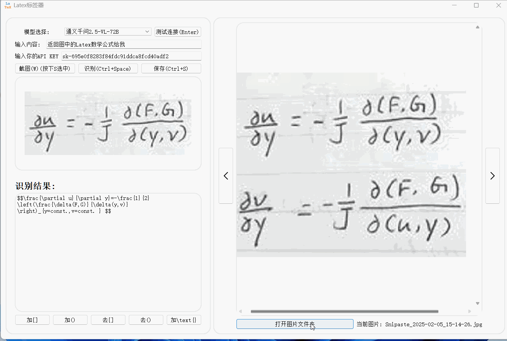

# Latex Tagger

## 项目概述
Latex Tagger 是一个基于 PyQt5 的桌面应用程序，允许用户通过截图和图像识别生成 Latex 标签。用户可以选择不同的模型进行图像识别，并将识别结果保存为图片和文本文件。

## 功能特点
- **截图功能**：用户可以使用快捷键进行截图
- **图像识别**：用户可以选择不同的模型进行图像识别，并显示识别结果。
- **保存功能**：用户可以将识别结果保存为图片和文本文件。
- **图片浏览**：用户可以浏览指定文件夹中的图片，并进行上一张、下一张的切换。

## 使用说明
1. **截图**：点击“截图(W)(按下S选中)”按钮或按下W键进行截图。按下S键选中截图区域。
2. **选择模型**：在“模型选择”下拉框中选择一个模型。
3. **输入API KEY**：在“输入你的API KEY”输入框中输入您的API KEY。
4. **输入提示词**：在“输入内容”输入框中输入您的提示词。
5. **测试连接**：点击“测试连接(Enter)”按钮或按下Enter键测试API连接。
6. **识别**：点击“识别(Ctrl+Space)”按钮或按下Ctrl+Space键进行图像识别。
7. **保存**：点击“保存(Ctrl+S)”按钮或按下Ctrl+S键保存识别结果。保存的结果会存放在图片文件夹目录的上一级目录的label_images和labels文件夹中。
8. **浏览图片**：点击“打开图片文件夹”按钮选择图片文件夹，使用左右箭头按钮或按下**A和D键**浏览图片。
9. **演示效果**：

10. **支持的大模型**：
    - 豆包: [https://console.volcengine.com/](https://console.volcengine.com/)，请在“大模型-模型广场”中找到**Doubao-vision-lite-32k、Doubao-vision-pro-32k、Doubao-1.5-vision-pro-32k**点击“查看详情-模型推理-确认接入”创建API Key。**注意:选择豆包模型需要输入对应的模型ID**
    
    - 通义千问: [https://www.aliyun.com/](https://www.aliyun.com/)，请在”大模型-模型广场“中找到“**通义千问2.5-VL-72B**”点击“API调用实例”创建API Key。
    - 月之暗面(Kimi): [https://www.moonshot.cn/](https://www.moonshot.cn/)，请在用户中心点击“API Key管理”创建新的API Key。

请在官网完成注册并获取对应模型的API接口。
